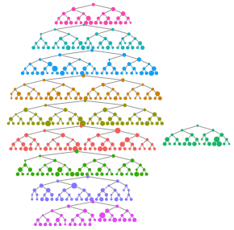

+++
title = ""
author = ["Mark S. Handcock"]
draft = false
date = 2022-08-24
tags = ["software"]
+++


# The `RDS` package

This is an R package for carrying out estimation with data collected using Respondent-Driven Sampling. This includes
Heckathorn's RDS-I and RDS-II estimators as well as Gile's Sequential Sampling estimator. 

The package is part of the "RDS Analyst" suite of
packages for the analysis of respondent-driven sampling data.

The package was developed by the [Hard-to-Reach Population Methods Research Group (HPMRG)](https://hpmrg.org).

See Gile and Handcock (2010) <doi:10.1111/j.1467-9531.2010.01223.x> and Gile and
Handcock (2015) <doi:10.1111/rssa.12091>.


# Installation

The package is available on CRAN and can be installed using

```{r}
install.packages("RDS")
```

<!-- To install the latest development version from github, the best way it to use git to create a local copy and install it as usual from there. If -->
<!-- you just want to install it, you can also use: -->

<!-- ```{r} -->
<!-- # If devtools is not installed: -->
<!-- # install.packages("devtools") -->
<!--  -->
<!-- devtools::install_github("HPMRG/RDS") -->
<!-- ``` -->

# Implementation

Load package and example data

```
library(RDS)
data(fauxmadrona)
```

`fauxmadrona` is a simulated RDS data set with no seed dependency, which is used to demonstrate RDS estimators. It has the format of an
`rds.data.frame` and is a sample of size 500 with 10 seeds and 2 coupons from a population of size 1000. For the purpose of this example, we
will assume the population size is unknown and our goal is to estimate it.

We can make a quick visualization of the recruitment chains, where the size of the node is proportional to the reported degree and the color
represents separate chains.

```{r}
reingold.tilford.plot(fauxmadrona, 
                      vertex.label=NA, 
                      vertex.size="degree",
                      show.legend=FALSE,
                      vertex.color="seed")
```



## The `RDS.SS.estimates` function

This function computes the sequential sampling (SS) prevalence estimates for a categorical variable or numeric
variable.
The confidence intervals are computed using a bootstrap procedure.

Here are the results for disease prevalence:

```{r}
RDS.SS.estimates(rds.data=fauxmadrona,outcome.variable="disease",N=1000)
```

    ## Gile's SS Estimate for disease 
    ##         Estimate         95% Interval Design Effect Std. Error     N
    ## disease   0.1946 (  0.1676,   0.2216)          1.21     0.0138   500
    ##                                                          Total   500
    ## * Using population size estimate: 1000

## Other primary functions 

These are the primary functions that users will call. They are detailed in the [manual](https://cran.r-project.org/web/packages/RDS/RDS.pdf)
with example `R` code.

* `bottleneck.plot`: This function creates a bottleneck plot to help diagnose convergence for RDS estimators. 
* `convergence.plot`: This function creates diagnostic convergence plots for RDS estimators. 
* `cumulative.estimate`: Calculates estimates at each successive wave of the sampling process 
* `differential.activity.estimates`: Computes the Differential Activity between groups 
* `homophily.estimates`: This function computes an estimate of the population homophily and the recruitment homophily based on a categorical variable.` 
* `LRT.trend.test`: Compute a test of trend in prevalences based on a likelihood-ratio statistic
* `MA.estimates`: This function computes the sequential sampling (MA) estimates for a categorical variable or numeric variable.
* `plot.rds.data.frame`: Diagnostic plots for the RDS recruitment process
* `RDS.bootstrap.intervals`: This function computes an interval estimate for one or more categorical variables. It optionally uses attributes of the RDS data set to determine the type of estimator and type of uncertainty estimate to use.
* `RDS.compare.proportions`: Compares the rates of two variables against one another`: This function computes an interval estimate for one or more categorical variables. It optionally uses attributes of the RDS data set to determine the type of estimator and type of uncertainty estimate to use.
* `RDS.HCG.estimates`: Prevalence estimates based on Fellows' Homophily Configuration Graph model
* `RDS.I.estimates`: Prevalence estimates based on the RDS-I type estimates for a categorical variable. It is also referred to as the Salganik-Heckathorn estimator.
* `RDS.II.estimates`: Prevalence estimates based on the RDS-II type estimates for a categorical variable. It is also referred to as the Salganik-Heckathorn estimator.
* `RDS.SS.estimates`: Prevalence estimates based on the sequential sampling (SS) model for a categorical or numerical variable. It is also referred to as the Gile estimator.

See the following papers for more information and examples:

#### Statistical Methodology

* Gile, Krista J. 2011 [Improved Inference for Respondent-Driven Sampling Data with Application to HIV Prevalence Estimation](https://doi.org/10.1198/jasa.2011.ap09475), Journal of the American Statistical Association, 106, 135-146.

*  Gile, Krista J., Handcock, Mark S., 2010 [Respondent-driven Sampling: An Assessment of Current
   Methodology](https://doi.org/10.1111/j.1467-9531.2010.01223.x), Sociological Methodology, 40, 285-327.

*  Gile, Krista J., Handcock, Mark S., 2011 [Network Model-Assisted Inference from Respondent-Driven Sampling
   Data](https://doi.org/10.1111/rssa.12091), Journal of the Royal Statistical Society, A. 

*  Salganik, M., Heckathorn, D. D., 2004. "Sampling and estimation in hidden populations using respondent-driven sampling.
Sociological Methodology 34, 193-239.

*  Volz, E., Heckathorn, D., 2008. Probability based estimation theory for Respondent Driven Sampling. The Journal of Official
Statistics 24 (1), 79-97.

#### Applications

A good tutorial on the use of our package, including example data and R code is:

* Khoury, R. (2020). [Hard-to-Survey Populations and Respondent-Driven Sampling: Expanding the Political Science
  Toolbox](https://doi.org/10.1017/S1537592719003864). Perspectives on Politics, 18(2), 509-526.

* Khoury, R. (2020). [Replication Data for: Hard-to-Survey Populations and Respondent-Driven Sampling: Expanding the Political Science
  Toolbox](https://doi.org/10.7910/DVN/XKOVUN),  Harvard Dataverse, V1.
